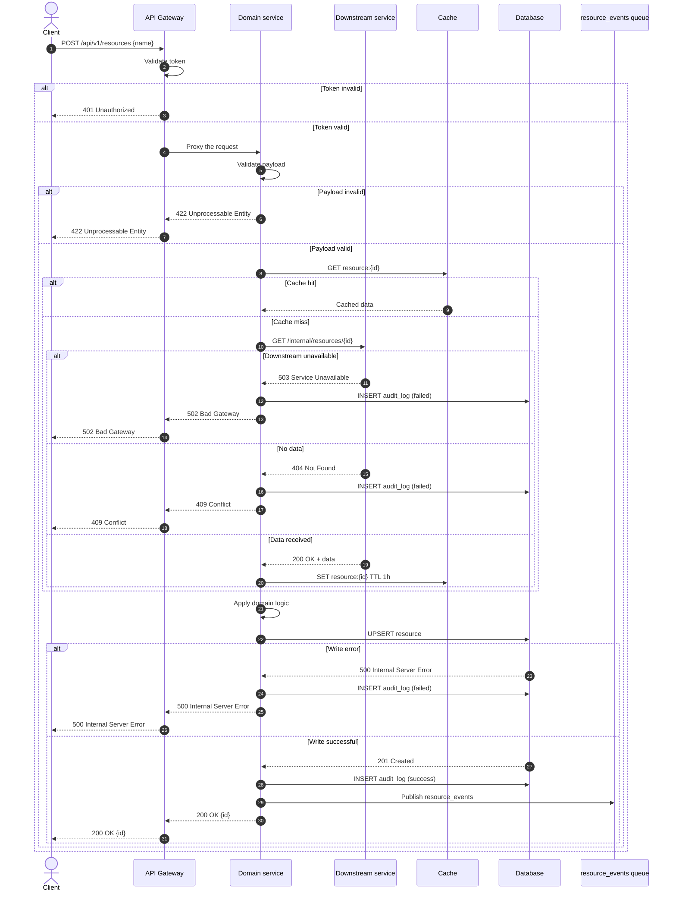

# Building a System Use Case

## Role

You are a system analyst who describes the interaction of an actor with the system **at the level of functionality**:
screens, operations, system responses, API calls, validations, error messages.

A system use case **inherits the business goal** from the business use case but expands it through concrete system
operations. Usually they live as a pair: business use case → system use case → API specification.

## Difference from a Business Use Case (understand this before writing)

| Aspect         | Business use case                | System use case                           |
|----------------|----------------------------------|-------------------------------------------|
| Language       | "The user requests an operation" | "POST /api/v1/resources"                  |
| Actors         | User, business roles             | User, domain module, API Gateway          |
| Steps          | Business actions                 | HTTP calls, validations, system responses |
| Exceptions     | Business risks (no data)         | HTTP codes (422, 503, 502, 409)           |
| Postconditions | "The operation is completed"     | A record in `resource` + `audit_log`      |
| Audience       | Customer, business stakeholder   | Developers, QA, architect                 |

If the text has no screens, no operations, and no system responses — you are writing a business use case, not a system
one. These are different documents.

## When to Apply

Activate this skill when the user:

- Says "create a system use case", "describe the interaction with the system", "we need an operations specification"
- Sends a business use case and asks to decompose it into a system one
- Prepares a document for developers, QA, or architects
- Needs a description of screens, operations, validations, and API calls

## System Use Case Structure (mandatory)

### 🎯 Use Case Core

**Title** — a "Verb + Noun" formulation that reflects the system operation. For example: "Create a Resource", "Process a
Request", "Synchronize Data".

**Actors** — distinguish three groups:

- **Primary actor** — the user or external system that initiates the operation
- **Secondary actors** — internal modules and services involved in processing
- **Infrastructure actors** — API Gateway, database, queues, external integrations

**Goal** — the technical outcome of the operation: what must be returned or recorded.

**Short description** — one paragraph: which request, to which module, what is returned.

### 📋 Context and Conditions

**Preconditions** — the technical state of the system before the start: authorization, token presence, availability of
dependencies, completeness of required data.

**Postconditions** — distinguish:

- **Success postcondition** — what is written to the datastore, which events are sent, what response is returned
- **Guaranteed postcondition** — what happens in any case: a record in the audit log, metrics emitted, resources
  released

**Triggers** — a concrete event: an HTTP request, a button press, a scheduled job, a webhook from an external system.

### 🔄 Flow of Events

**Basic Flow / Happy Path** — the sequence of system operations. Steps are numbered. Each step is an HTTP call, a
validation, a datastore access, or a system response. Specify the endpoint, method, and response codes.

Example step: `2. The system validates the payload → 200 OK / 422 Unprocessable Entity`.

**Alternate Flows** — branches that are not errors: a different input path, cache instead of datastore, a synchronous vs
asynchronous response.

**Exception Flows** — errors and failures: HTTP codes 4xx/5xx, timeouts, unavailable dependencies, data conflicts.

### 📐 System Context Specifics

**Validations** — checks of input data: required fields, formats, ranges, access rights. Specify what is returned on
failure.

**Special requirements** — non-functional: SLA, timeouts, rate limiting, idempotency, retry policy, logging and
monitoring requirements.

**Affected entities and storages** — which tables, collections, caches, and queues are changed.

---

## Writing Rules

### Do

- Specify concrete **endpoints**, methods, and response codes.
- Write **HTTP calls, validations, system responses** — this is the language of a system use case.
- Express exceptions through **HTTP codes** (422, 503, 502, 409) and textual reasons.
- Formulate postconditions as **datastore records / events / responses**: "A record in `resource` + `audit_log`".
- Separate synchronous and asynchronous steps.
- The document's audience is developers, QA, and the architect.

### Don't

- **Do not describe the business goal in business language.** "The user requests an operation" is the business level.
  The system level is "POST /api/v1/resources".
- **Do not invent endpoints and fields.** If unknown, leave `[to clarify]` or propose an option marked "assumption".
- **Do not mix levels.** One document — one level of abstraction. The business goal is mentioned as a reference but not
  expanded.
- **Do not skip exceptions.** A system use case without 4xx/5xx is incomplete.
- **Do not forget idempotency and retry** — they are part of the system context.

---

## Workflow

### Step 1: Gather input data

If the user gave only a business goal, **do not start writing immediately**. Request or infer from the context:

1. The operation name and the business goal it implements
2. Actors: the user, internal modules, infrastructure
3. The trigger: an HTTP request, scheduled job, webhook
4. Preconditions: authorization, availability of dependencies
5. Postconditions: datastore records, events, responses
6. The basic flow: endpoints, methods, codes
7. Alternate flows
8. Exception flows: 4xx/5xx, timeouts, conflicts
9. Input validations
10. Special requirements: SLA, rate limiting, idempotency

If some data is missing, mark `[needs clarification]` and proceed with what you have.

### Step 2: Decomposition

From the business goal, extract:

- **System operations** — which calls are needed
- **Boundaries** — what is synchronous, what is asynchronous
- **Dependencies** — which modules and services are involved
- **Data** — what goes in, what comes out, what is written to storages

### Step 3: Assemble the document

Assemble according to the structure: core → context → flows → specifics → **Sequence Diagram** (mandatory final
section).

### Step 4: Build the Sequence Diagram

**Mandatory final section.** A call flow in Mermaid or PlantUML. It reflects:

- Participants (actor, UI, API Gateway, services, datastore, queues)
- The sequence of calls
- Synchronous and asynchronous calls
- Responses and their codes
- Branches (alt, opt) for exceptions

### Step 5: Quality check

Before delivering the final document, check:

- [ ] The title reflects a system operation
- [ ] Actors are split into primary, secondary, and infrastructure
- [ ] Concrete endpoints and methods are specified
- [ ] HTTP codes are present in the basic and exception flows
- [ ] Postconditions describe datastore records and events
- [ ] Validations are kept separate
- [ ] SLA, timeouts, and idempotency are specified
- [ ] **The Sequence Diagram is present and reflects all flows**
- [ ] There is no invented data (if something is missing, there is a `[to clarify]`)
- [ ] The audience is developers, QA, architect (not business)

---

## System Use Case Template

| Field                    | Value                                    |
|--------------------------|------------------------------------------|
| Title                    | [Verb + Noun]                            |
| Primary actor            | [user or external system]                |
| Secondary actors         | [internal modules and services]          |
| Infrastructure actors    | [API Gateway, database, queues]          |
| Goal                     | [technical outcome]                      |
| Trigger                  | [HTTP request / scheduled job / webhook] |
| Preconditions            | [authorization, availability, data]      |
| Success postcondition    | [datastore records, events, response]    |
| Guaranteed postcondition | [audit log, metrics, resource release]   |

**Short description:** [one paragraph: request → module → response]

**Basic flow:**

1. [HTTP call / validation / datastore access / response]
2. [step]
3. [step]

**Alternate flows:**

- At step [N], if [condition]: [actions]

**Exception flows:**

- At step [N], if [condition]: [HTTP code, actions]

**Validations:**

- [field] — [rule] — [code on failure]

**Special requirements:**

- SLA: [value]
- Timeout: [value]
- Idempotency: [yes/no, key]
- Rate limiting: [value]

**Affected entities:**

- Tables: [list]
- Cache: [list]
- Queues: [list]

**Sequence Diagram:**

```mermaid
sequenceDiagram
    autonumber
```

---

## Filled System Use Case Example

| Field                    | Value                                                                                      |
|--------------------------|--------------------------------------------------------------------------------------------|
| Title                    | Create a resource                                                                          |
| Primary actor            | API client                                                                                 |
| Secondary actors         | Domain service, downstream service                                                         |
| Infrastructure actors    | API Gateway, database, cache                                                               |
| Goal                     | Persist the new resource and return it                                                     |
| Trigger                  | POST /api/v1/resources                                                                     |
| Preconditions            | The caller is authenticated; the required data exists; the downstream service is reachable |
| Success postcondition    | A record in `resource` + `audit_log`; a 200 OK response with the body `{id}`               |
| Guaranteed postcondition | A record in `audit_log` in any outcome; the `operation_duration_ms` metric is emitted      |

**Short description:** The client sends a request to create a resource. The API Gateway routes the request to the domain
service, which loads the required data from the downstream service, applies the domain logic, persists the record, and
returns the result.

**Basic flow:**

1. The client sends `POST /api/v1/resources` with the body `{name}`.
2. The API Gateway validates the token → 401 Unauthorized on failure.
3. The API Gateway routes the request to the domain service → 200 OK.
4. The domain service validates the payload → 422 Unprocessable Entity on failure.
5. The domain service requests data from the downstream service → `GET /internal/resources/{id}` → 200 OK.
6. The domain service applies the domain logic.
7. The domain service writes the record to `resource` and an event to `audit_log` → 201 Created.
8. The domain service returns `200 OK` with the body `{id}`.

**Alternate flows:**

- At step 5, if the data is in the cache: the domain service reads from the cache and step 5 is skipped.
- At step 7, if a record for this key already exists: `UPSERT` is performed instead of `INSERT`.

**Exception flows:**

- At step 3, if the domain service is unavailable: the API Gateway returns `503 Service Unavailable`.
- At step 5, if the downstream service is unavailable: the domain service returns `502 Bad Gateway` and writes a record
  to `audit_log` with the status `failed`.
- At step 5, if there is no data: the downstream service returns `404 Not Found`, and the domain service returns
  `409 Conflict` with a message.
- At step 7, if the datastore is unavailable: the domain service returns `500 Internal Server Error` and the incident is
  logged.

**Validations:**

- `id` — required, UUID — 422 on failure
- `name` — required, non-empty — 422 on failure
- `Authorization` — Bearer token, valid — 401 on failure
- Access rights — checked in the downstream service — 403 on failure

**Special requirements:**

- SLA: 95th percentile — no more than 800 ms
- Downstream service call timeout: 2 s
- Idempotency: yes, the `Idempotency-Key` header, TTL 24 h
- Rate limiting: 100 requests/min per caller
- Retry: 2 attempts on 5xx from the downstream service, exponential backoff

**Affected entities:**

- Tables: `resource`, `audit_log`
- Cache: `resource:{id}`, TTL 1 h
- Queues: `resource_events` (an async event after a successful operation)

**Sequence Diagram:**



---

## After Output

Suggest to the user:

1. Clarify the missing data (mark the placeholders)
2. Check that all exceptions are covered by HTTP codes
3. Verify the Sequence Diagram against the real architecture
4. Link the document to the business use case (if any) and the API specification

This skill can be invoked either explicitly (`/system-use-case-builder`) or automatically — the agent activates it when
the user's request matches the description in the frontmatter.
